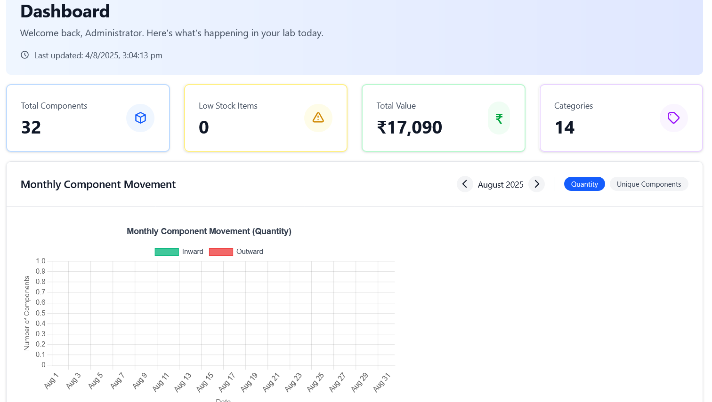
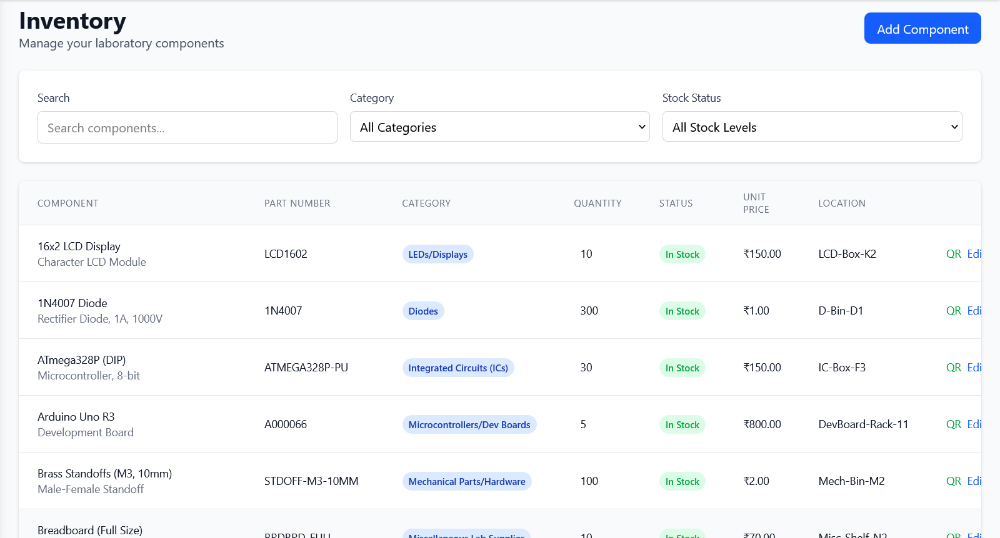
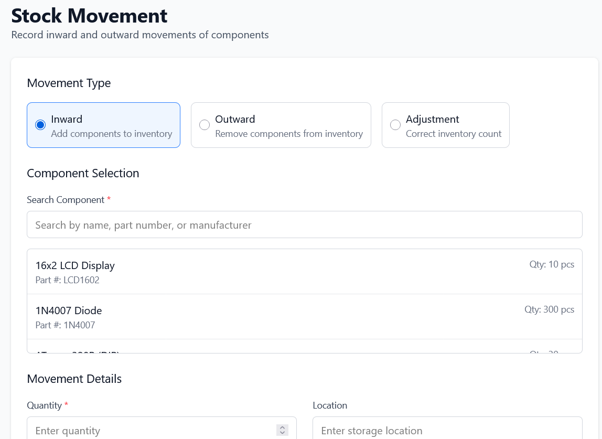
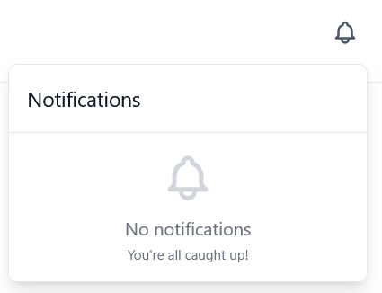
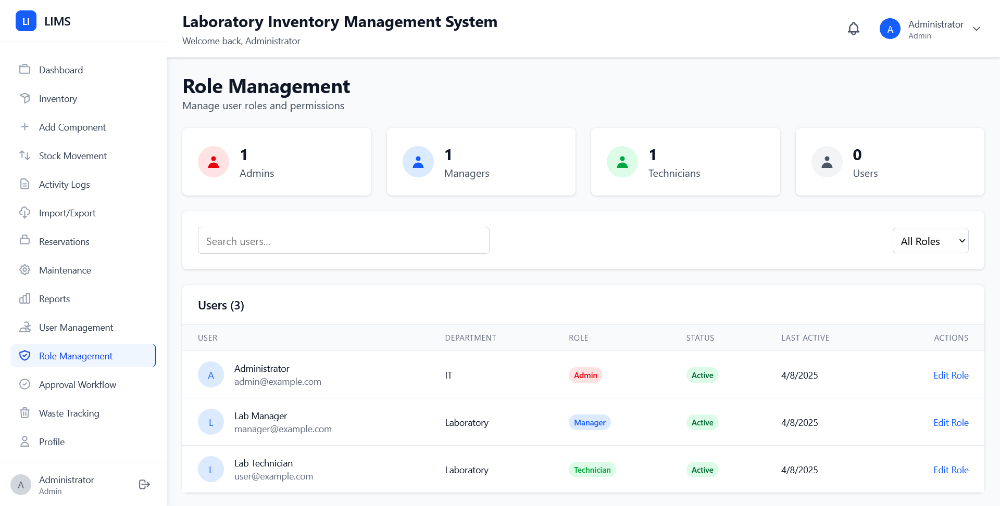
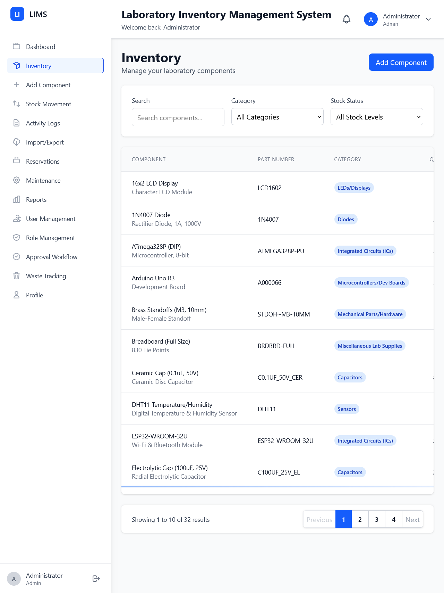
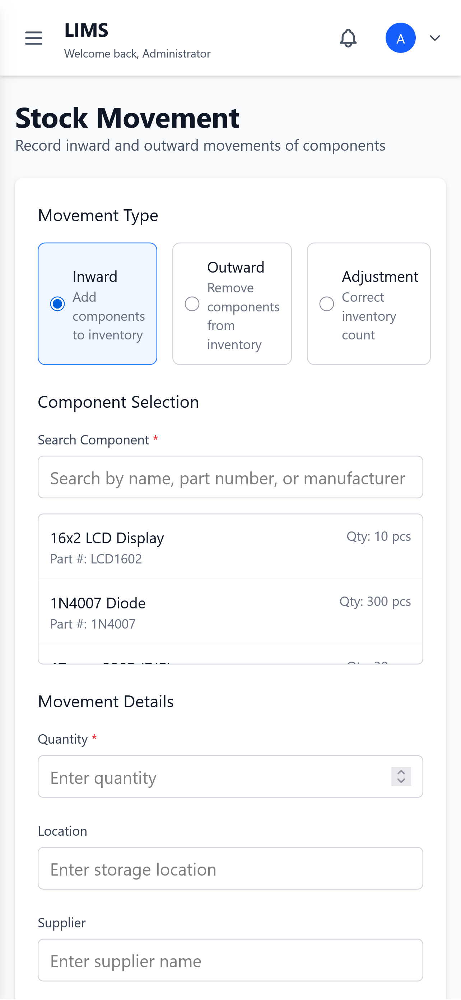

# A-1 Launchpad | Laboratory Inventory Management System (LIMS) 🔬⚡


A full-stack, enterprise-grade laboratory inventory management platform engineered for electronics R&D and manufacturing labs to catalog high-density components, track transactional stock movements, manage equipment maintenance, and enforce audit-compliant approval workflows.

**Live Demo (Vercel):** [https://lims-harshit.vercel.app](https://lims-harshit.vercel.app)

---

## 🎯 Overview & Problem Solved

Modern engineering and testing laboratories manage thousands of passive devices, microcontrollers, high-speed ICs, and lab consumables. Traditional spreadsheets lead to:
- **Disorganized Stock Tracking**: Inability to quickly locate physical parts, resulting in duplicate procurement.
- **Stockout Risks**: Lack of automated threshold alerts for critical project components.
- **Missing Audit Trails**: Untracked component consumption and unaccountable stock adjustments.
- **Unmanaged Lab Assets**: Equipment maintenance oversights and hazardous laboratory waste compliance issues.

**A-1 Launchpad** solves these challenges by providing real-time inventory visibility, transactional stock movement logging, equipment maintenance scheduling, hazardous waste compliance tracking, and role-based approval hierarchies in a responsive dashboard.

---

## 🚀 Key Features

### 1. 📦 Inventory & Component Management
- **Cataloging**: Parametric tracking of part numbers, categories, package footprints, datasheets, storage locations, and supplier details.
- **Stock Health & Thresholds**: Automatic low-stock alerting and stock status calculation (`In Stock`, `Low Stock`, `Out of Stock`).
- **QR Code Generation**: Client-side QR generation and in-browser camera scanning for rapid physical component identification.

### 2. 🔄 Transactional Stock Movements & Audit Trails
- **Movement Types**: Log `inward` (procurement/restocking), `outward` (issues to projects/students), and `adjustment` (physical count reconciliations).
- **Immutable Audit Logging**: Captures timestamp, quantity delta, unit price, purpose, invoice number, and actor ID.

### 3. 🛠️ Equipment Maintenance Tracking
- **Maintenance Categories**: Schedule and log `preventive`, `corrective`, `calibration`, and `inspection` activities.
- **Lifecycle Tracking**: Monitor equipment downtime, track resolution notes, assign technician tasks, and record service costs.

### 4. ☣️ Hazardous Waste Tracking & Disposal
- **Regulatory Compliance**: Log `Chemical`, `Electronic`, and `Sharps` waste with associated hazard ratings (`low`, `medium`, `high`, `extreme`).
- **Disposal Verification**: Track container codes, compliance certificates, and disposal methodologies (`Recycling`, `Neutralization`, `Special Disposal`).

### 5. 👥 Role-Based Access Control (RBAC) & Approval Chains
- **Granular Permissions**: Built-in authorization across 4 defined roles:
  - 👑 **Admin**: Global platform administration, user management, and system-wide overrides.
  - 👔 **Manager**: Approvals, high-value component acquisitions, reports, and stock adjustments.
  - 🔧 **Technician**: Equipment maintenance logging, stock issues, and reservation fulfillment.
  - 🔬 **User / Researcher**: Component reservations and parts requests.
- **Multi-Level Approval Workflows**: Formal review workflows with approver comments and status tracking (`pending`, `approved`, `rejected`).

### 6. 📊 Analytics & Reporting
- **Interactive Visualizations**: Monthly inward/outward movement trends, category distribution, and critical stock widgets powered by Chart.js.
- **Import / Export**: Excel (`.xlsx`) batch component import and multi-format transaction log exporting.

---

## 💻 Tech Stack

| Layer | Technologies |
|---|---|
| **Frontend** | React 19, Vite, Tailwind CSS, Chart.js, React Router v7, Lucide Icons, React Toastify |
| **Backend** | Node.js, Express.js, `serverless-http` |
| **Database** | MongoDB Atlas, Mongoose ODM |
| **Authentication** | JSON Web Tokens (JWT) & bcryptjs |
| **CI/CD & DevOps** | GitHub Actions, AWS Lambda, Amazon API Gateway (HTTP API), Vercel Edge CDN |

---

## 🏛️ High-Level Architecture

```
                                  ┌─────────────────────────────┐
                                  │      Client Web Browser     │
                                  └──────────────┬──────────────┘
                                                 │
                        ┌────────────────────────┴────────────────────────┐
                        ▼                                                 ▼
             [Local Dev Environment]                            [Production Deployment]
             • URL: http://localhost:5173                       • Vercel Edge Network
             • Proxy: http://localhost:5000                     • SPA Client App
                        │                                                 │
                        ▼                                                 ▼
             [Local Express Server]                             [AWS API Gateway]
             • `node server.js` (port 5000)                     • HTTP API Endpoint
             • Mongoose Connection                              • CORS & Stage Normalization
                        │                                                 │
                        │                                                 ▼
                        │                                       [AWS Lambda Function]
                        │                                       • `lambda.handler`
                        │                                       • Express via `serverless-http`
                        │                                                 │
                        └────────────────────────┬────────────────────────┘
                                                 ▼
                                     [MongoDB Atlas Cluster]
                                     • Collections: Users, Components,
                                       Logs, Maintenance, Waste, Approvals
```

---

## ⚙️ Environment Configuration

### Backend (`server/.env`)
Create a `.env` file in the `server` directory using [`server/.env.example`](server/.env.example):
```env
PORT=5000
MONGO_URI=mongodb+srv://<username>:<password>@<cluster-url>/<database_name>?retryWrites=true&w=majority
JWT_SECRET=your_jwt_secret_key
CLIENT_URL=http://localhost:5173
NODE_ENV=development
```

### Frontend (`client/.env`)
Create a `.env` file in the `client` directory using [`client/.env.example`](client/.env.example):
```env
# Point to localhost for local dev or API Gateway for production
VITE_API_BASE_URL=http://localhost:5000/api
VITE_APP_NAME=A-1 Launchpad
VITE_APP_VERSION=1.0.1
VITE_FEATURE_NOTIFICATIONS=true
VITE_FEATURE_BARCODE_SCANNER=true
VITE_FEATURE_QR_CODE=true
VITE_API_TIMEOUT=10000
```

---

## 🛠️ Local Installation & Run Guide

### Prerequisites
- **Node.js**: v18.0.0 or higher
- **npm**: v9.0.0 or higher
- **MongoDB**: Active MongoDB Atlas cluster or local MongoDB instance

### 1. Clone the Repository
```bash
git clone https://github.com/Harshit-Patle/A-1-Launchpad.git
cd A-1-Launchpad
```

### 2. Setup and Run Backend
```bash
cd server
npm install
cp .env.example .env
# Configure MONGO_URI and JWT_SECRET in server/.env
npm run dev
```
*Backend starts on `http://localhost:5000`.*

### 3. Setup and Run Frontend
Open a new terminal window:
```bash
cd client
npm install
cp .env.example .env
npm run dev
```
*Frontend starts on `http://localhost:5173`.*

---

## 🔑 Demo Login Credentials

| Role | Email | Password | Permissions |
|---|---|---|---|
| **Admin** | `admin@lims.com` | `admin123` | Full access, user management, system config |
| **Manager** | `manager@lims.com` | `manager123` | Approvals, inventory management, reports |
| **Technician** | `technician@lims.com` | `technician123` | Maintenance logging, stock transactions |
| **User** | `user@lims.com` | `user123` | Component requests and reservations |

---

## 📸 Screenshots & UI Showcase

### Central Dashboard


### Inventory Management & Search


### Transactional Stock Movement Tracking


### Notification & Alerts Center


### Responsive Breakpoints
| Desktop View | Tablet View | Mobile View |
|---|---|---|
|  |  |  |

---

## 🧠 Key Technical Decisions

1. **Dual-Target Server Architecture (`app.js` vs `server.js` vs `lambda.js`)**:
   - Express application routing and middleware are extracted into `server/app.js`.
   - `server/server.js` boots the standard HTTP server on port 5000 for zero-configuration local development.
   - `server/lambda.js` wraps the application via `serverless-http` for stateless execution on AWS Lambda.
2. **Dynamic Stage & Function Name Normalization**:
   - AWS API Gateway HTTP API triggers prepend stage paths (such as `/default/lims-backend`). Custom middleware normalizes incoming request URLs before Express route matching.
3. **Optimized Mongoose Connection Handling for Serverless**:
   - `server/config/db.js` reuses open connections across Lambda warm invocations and configures connection pool sizes (`maxPoolSize: 10`, `minPoolSize: 0`) to prevent socket starvation in serverless environments.
4. **Automated CI/CD with GitHub Actions**:
   - Automated workflow in `.github/workflows/deploy-backend.yml` builds production bundles and updates AWS Lambda code on every push to `main`.

---

## ⚠️ Known Limitations

- **Camera Permissions for QR Scanner**: QR scanning requires browser camera permissions and an HTTPS connection (or `localhost`) to access `navigator.mediaDevices`.
- **Serverless Cold Starts**: Initial invocation after idle periods on AWS Lambda may incur a 1–2 second latency while the container and database connection pool initialize.
- **Export File Memory Limit**: Large Excel and PDF generation is performed in-memory; very large datasets (>50,000 records) should ideally be streamed or generated asynchronously via background jobs.

---

## 📄 License

This project is licensed under the MIT License - see the [LICENSE](LICENSE) file for details.

---

© 2025–2026 **Harshit Patle**. All rights reserved.
